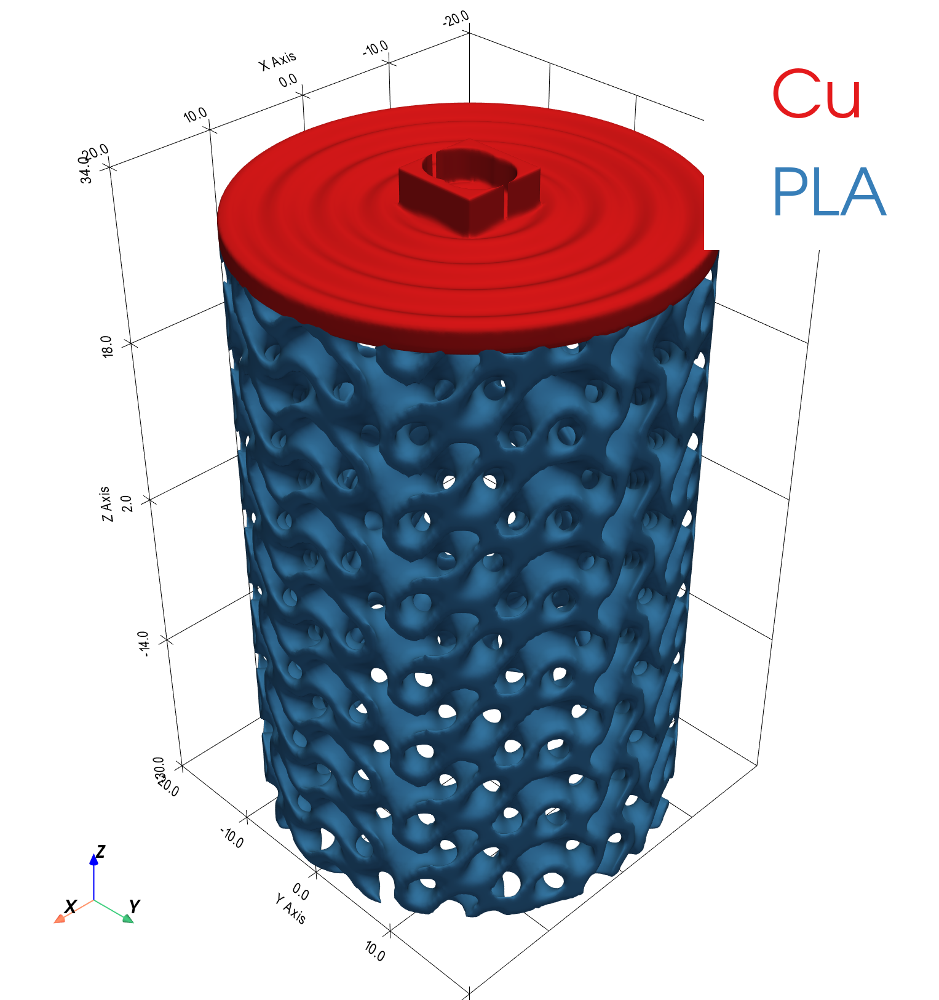
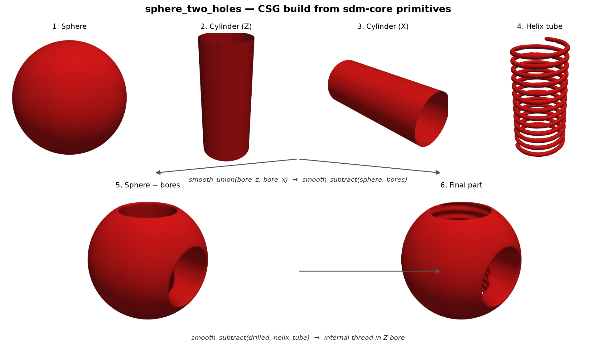

<a id="readme-top"></a>

# Software Defined Matter: Core

[](LICENSE)
[](https://www.python.org/downloads/)
[](https://docs.jax.dev/)
[](https://docs.astral.sh/uv/)

The core Python library for **Software Defined Matter (SDM)**: a versioned
`.sdm` part format, a JSON-serializable SDF geometry DSL, and a
JAX-traceable evaluation core that compiles a part into differentiable
closures.



*The example part built by [`examples/build_example.py`](examples/build_example.py):
two materials, a gyroid infill, and a notch hinge, with no mesh authoring.*

<details>
  <summary>Table of contents</summary>

  1. [Install](#install)
  2. [Quickstart](#quickstart)
  3. [What this library provides](#what-this-library-provides)
  4. [What is intentionally outside core](#what-is-intentionally-outside-core)
  5. [Documentation](#documentation)
  6. [Built with](#built-with)
  7. [Contributing](#contributing)
  8. [Support](#support)
  9. [License](#license)
  10. [Acknowledgments](#acknowledgments)

</details>

New to SDM as a whole? Start with
[Concepts](https://github.com/EmergentMatter/emergent-matter-sdm/blob/main/docs/concepts.md)
in the `emergent-matter-sdm` documentation repo, which explains the CEM,
the `.sdm` file, and the Define / Standardize / Evolve pipeline. This
README covers the library itself.

## Install

This package uses [`uv`](https://docs.astral.sh/uv/) and a src-layout. It is
published to the Software Defined Matter package index, not PyPI, along with the
[`emergent-matter-sdm-materials`](https://github.com/EmergentMatter/emergent-matter-sdm-materials)
package it depends on:

```bash
uv pip install emergent-matter-sdm-core --index https://get.softwaredefinedmatter.com/simple
```

To work on this repo, clone it and sync:

```bash
git clone https://github.com/EmergentMatter/emergent-matter-sdm-core.git
cd emergent-matter-sdm-core
uv sync
```

Add `--extra export` if you need `export_part` (manufacturing-fidelity
`.stl`/`.obj`/`.ply` meshing via scikit-image + trimesh); the core library and
`preview_part` work without it.

## Quickstart

A copy-pasteable smoke test, once installed -- builds a part in memory,
round-trips it through the `.sdm` JSON format, and prints its volume:

```python
from software_defined_matter import (
    MaterialRegion,
    Param,
    Part,
    make_param_ref,
    sdf_primitive,
)
from software_defined_matter.io import load, save

p_radius = Param(name="radius", value=8.0, free=True, bounds=(2.0, 20.0), unit="mm")

part = Part(
    name="quickstart_sphere",
    params={p_radius.name: p_radius},
    materials=[
        MaterialRegion(
            material_id=1,
            name="PLA",
            sdf_tree=sdf_primitive("sphere", r=make_param_ref("radius")),
        )
    ],
)

save(part, "quickstart_sphere.sdm")
reloaded = load("quickstart_sphere.sdm")
print(reloaded.materials[0].sdf_tree)
```

See `examples/build_example.py` for the fuller worked example (the part shown
at the top of this README), `examples/preview_example.py` for an interactive
PyVista preview, and `examples/export_example.py` for a manufacturing-fidelity
mesh export.

## What this library provides

- **A versioned `.sdm` format with a real wire contract.** A document's
  `schema_version` is the *minimum version a tool must support to read
  it*, computed from the document's content rather than stamped by the
  writer. Structural validation runs against per-version JSON schemas,
  semantic validation against a single declarative contract in `wire.py`.
  The current schema is generated from that contract, so it cannot drift
  from it; once a version is released its schema is frozen. See
  [ADR 0001](docs/adr/0001-sdm-wire-contract.md), and
  [`docs/schema-versioning.md`](docs/schema-versioning.md) for how a new
  version is cut.
- **A Python domain model for parts.** `Part`, `Param`, `MaterialRegion`,
  `Port`, `Objective`, `Constraint`, with JSON round-tripping.
- **An SDF tree DSL that serializes to JSON.** Primitives, CSG ops,
  transforms, modifiers, deformations, 2-D to 3-D lifting, sweeps, lofts,
  and helices, with parameter references (`$ref`) so free params flow into
  the geometry.

  Geometry is a tree, and the tree is data. A sphere with cross-drilled
  holes and a helical thread is written as nested ops:

  ```json
  "sdf_tree": { "op": "smooth_subtract", "children": [
      { "op": "smooth_subtract", "children": [
          { "primitive": "sphere" },
          { "op": "smooth_union", "children": [
              { "primitive": "capped_cylinder" },
              { "transform": "rotate_y", "child": { "primitive": "capped_cylinder" } }
          ]}
      ]},
      { "primitive": "helix" }
  ]}
  ```

  

  Simplified to show the shape of the format; a real node carries its
  parameters too.
- **A JAX-traceable compiler.** SDF trees compile to closures over points
  and a free-parameter vector, supporting hard and smooth CSG,
  differentiable transforms, and displacement fields.
- **An objective/constraint expression DSL** and a **differentiable metric
  registry** (`volume`, `mass`, `surface_area`, `centroid`,
  `relative_density`, and custom metrics via registration).
- **Probabilistic params** (schema 0.3), turning an `.sdm` into a
  generative model: Monte Carlo sampling and propagation over parameter
  priors. Sampling only, with no inference and no verdicts.

Each of these is documented where it is defined. The docstrings are the
reference; they are reviewed with the code, so they do not drift from it.

## What is intentionally outside core

`sdm-core` is the source-of-truth format and differentiable evaluation
layer, not the full manufacturing stack. Optimizer orchestration,
high-fidelity multiphysics solving, toolpath generation, and CAD authoring
UX all live downstream. See
[`docs/architecture.md`](docs/architecture.md#current-boundaries-what-is-intentionally-outside-core)
for the reasoning.

Material properties live in the separate
[`emergent-matter-sdm-materials`](https://github.com/EmergentMatter/emergent-matter-sdm-materials)
package, not here.

## Documentation

| Page | What it covers |
|---|---|
| [`docs/architecture.md`](docs/architecture.md) | Where core sits, how the directories divide the work, and what is deliberately out of scope |
| [`docs/optimization.md`](docs/optimization.md) | What is differentiable, choosing an optimizer, and the bounding box as metric sampling domain |
| [`docs/adr/`](docs/adr/) | Architecture decision records |
| [`docs/`](docs/) | Everything else, indexed |
| [STYLE.md](STYLE.md) / [CONTRIBUTING.md](CONTRIBUTING.md) | House style and how a change ships |

Those pages document this library. For the wider SDM ecosystem and the
other repositories in it, see
[`emergent-matter-sdm`](https://github.com/EmergentMatter/emergent-matter-sdm).

## Built with

| | |
|---|---|
| [JAX](https://docs.jax.dev/) | Autodiff and JIT. Every SDF compiles to a JAX-traceable closure |
| [NumPy](https://numpy.org/) | Grid construction and mesh arrays |
| [PyVista](https://pyvista.org/) | The display-only preview surface, in the optional `preview` extra |
| [jsonschema](https://python-jsonschema.readthedocs.io/) | Structural validation of `.sdm` documents |
| [scikit-image](https://scikit-image.org/) + [trimesh](https://trimesh.org/) | Marching cubes and mesh export, in the optional `export` extra |
| [uv](https://docs.astral.sh/uv/) | Packaging and the locked dev environment |

## Contributing

See [CONTRIBUTING.md](CONTRIBUTING.md) for how a change ships: the
changeset a pull request needs, what counts as major, minor, or patch,
and how a release is cut. [STYLE.md](STYLE.md) is the house style for
code, tests, and docs, and it wins over habit.

By participating you agree to the
[Code of Conduct](CODE_OF_CONDUCT.md).

## Support

Questions and usage help go to
[Discussions](https://github.com/EmergentMatter/emergent-matter-sdm/discussions);
bugs and feature requests go to
[Issues](https://github.com/EmergentMatter/emergent-matter-sdm-core/issues).
See [SUPPORT.md](SUPPORT.md) for what is and is not supported.

For security reports, do not open a public issue. Follow
[SECURITY.md](SECURITY.md).

## License

Apache-2.0. See [`LICENSE`](LICENSE) and [`NOTICE`](NOTICE).

## Acknowledgments

- The SDF primitive conventions, and much of the CSG vocabulary, follow
  [Inigo Quilez's distance function work](https://iquilezles.org/articles/distfunctions/).
- The TPMS lattice families (gyroid, Schwarz, Neovius, Lidinoid) come from
  the minimal-surface literature; the correction constants this repository
  applies to them are derived in
  [`docs/sdf_distances/`](docs/sdf_distances/sdf_distance_report.md).

<p align="right">(<a href="#readme-top">back to top</a>)</p>
