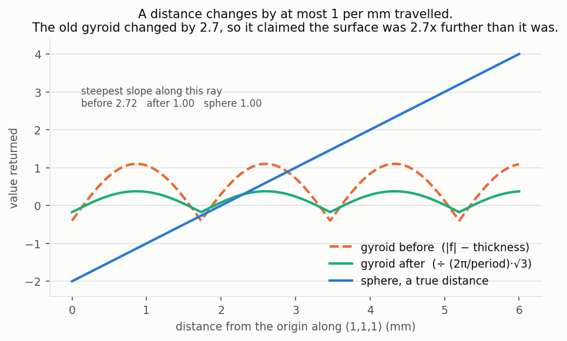
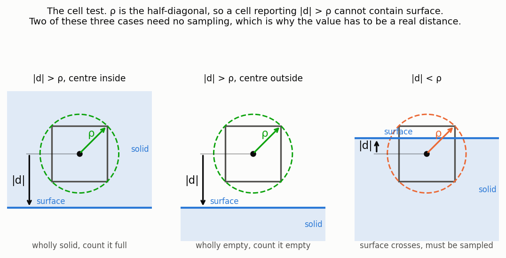
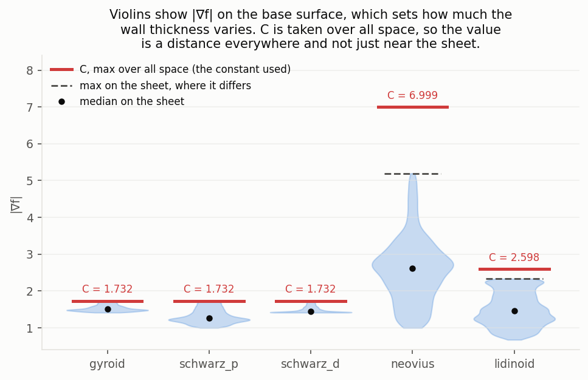
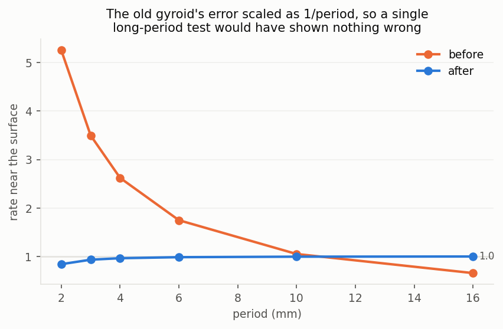
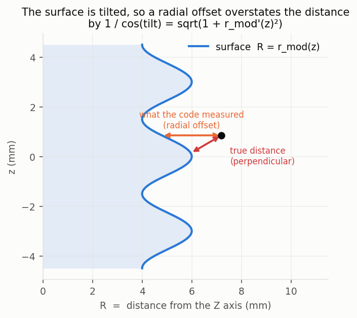
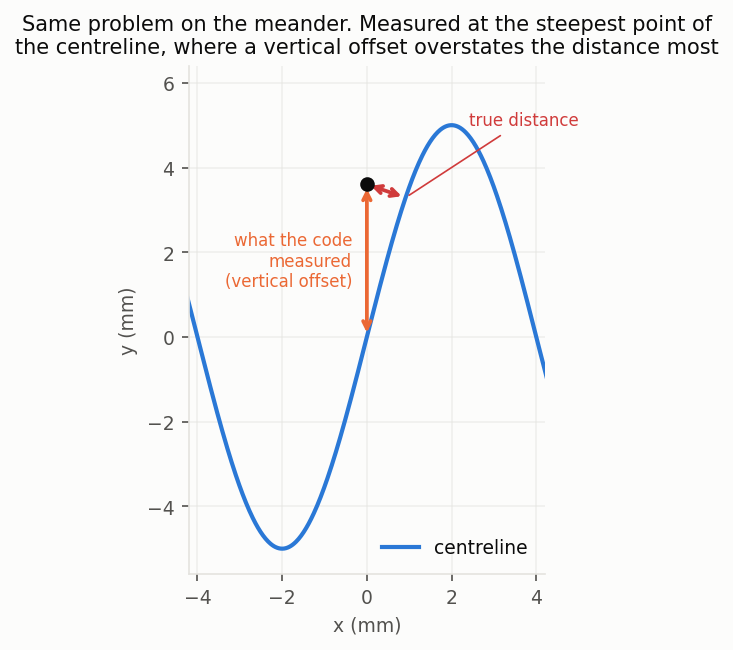
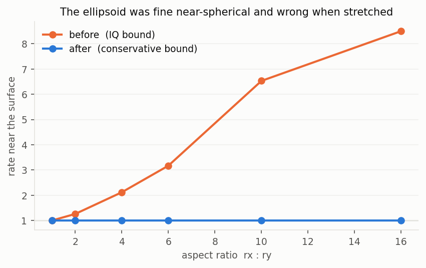
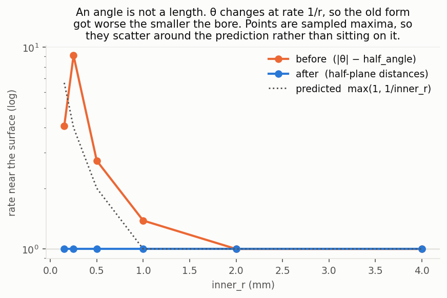

# SDF primitives that were not returning distances

Audit and fixes for primitives whose field was not a true distance.
Nine of the thirty-nine primitives returned a number that was zero on the
surface and correctly signed, but was not measuring how far away the
surface was. This document records what was wrong, where each correction
constant comes from, and why several plausible-looking fixes were rejected.

Every number and figure here is generated from data

## Contents

- [What an SDF promises](#what-an-sdf-promises)
- [Why it matters](#why-it-matters)
- [How the audit measures it](#how-the-audit-measures-it)
- [The five TPMS lattices](#the-five-tpms-lattices)
- [bellows and serpentine](#bellows-and-serpentine)
- [ellipsoid](#ellipsoid)
- [annular_sector](#annular_sector)
- [Approaches that were tried and rejected](#approaches-that-were-tried-and-rejected)
- [What the fixes cost](#what-the-fixes-cost)
- [How the geometry was kept identical](#how-the-geometry-was-kept-identical)
- [Finding the rate of a whole .sdm tree](#finding-the-rate-of-a-whole-sdm-tree)

## What an SDF promises

A signed distance function returns how far a query point is from the nearest
surface, negative inside. That promise has a consequence you can test: move one
millimetre through space and the returned value can change by at most one
millimetre. It can change by less, if you move sideways along the surface, but
never by more. Call that ratio the **rate**, and measure it as the gradient
magnitude.

| rate | meaning |
|---|---|
| 1.00 | exact |
| below 1 | under-reports the distance, safe but conservative |
| above 1 | **over-reports**, claims the surface is further than it is |



The sphere climbs at exactly 1 per millimetre travelled. The old gyroid climbed
at 2.72 along the same ray, so a caller reading 2.7 from it was really 1 mm from
the surface.

Sampling along a coordinate axis would have hidden this. Along x the gyroid
collapses to `sin(2πx/period)`, whose slope only reaches `2π/period`. The true
maximum sits at the origin in the (1,1,1) direction, which is the ray plotted
above.

## Why it matters

Three things in the codebase do arithmetic on the returned value as if it were
a length. All three give wrong answers when it is not.

### Measuring volume

`objectives/metrics.py` estimates a part's volume by chopping its bounding box
into a grid of cubic cells and asking, for each one, how much of it is filled.
Most cells are easy. A cell buried in solid material is completely full and one
out in open space is completely empty. Only the cells the surface actually
passes through need any thought, and they are a thin shell around the boundary.

Finding that shell is where the distance gets used. A cell of edge length `h`
has its farthest interior point at the corner, `ρ = h·√3/2` from the centre. So
if the SDF at the centre reports a distance larger than `ρ`, no part of that
cell can reach the surface. It is wholly solid or wholly empty, the sign says
which, and it never needs sampling again.



Skipping those cells changes how the cost grows. The number of cells needing
work follows the part's surface area rather than its volume: measured at 4.0x
per resolution doubling instead of 8.0x, with only 2 to 8 percent of cells still
live at resolution 256. That is what makes a fine grid affordable.

It only works if the reported distance can be trusted. When a primitive
over-reports, cells that do contain surface pass the `|d| > ρ` test, get written
off as uniform, and their material vanishes from the volume with no error
raised. Tested on a gyroid at `period=4`: of the 3,456 cells the rule declared
uniform, **3,456 actually contained surface**. Every one.

### Checking clearances between parts

`audit.py` answers "is the gap between these two bodies the number the design
promised?", which matters for print-in-place mechanisms where a stacked
clearance produces a part that runs twice as loose as intended. It computes the
separation as `min(d_A + d_B)` over a sample grid, adding the two bodies'
distances at each point and taking the smallest sum.

That identity holds because each term is a distance to its own body. Feed it a
value inflated by 2.3x and the reported gap is inflated too, so a mechanism can
be signed off on a clearance it does not have. Any part using one of these nine
primitives was getting wrong numbers.

### Rendering the shader preview

`glsl/lib.glsl` draws parts by sphere tracing: march along a ray, ask the SDF
how far the nearest surface is, and jump that far, knowing nothing can be hit in
between. Repeat until the value is near zero.

The jump length is the returned value, so the whole method depends on it being
an under-estimate of the true distance. A value that is too large steps the ray
straight through the surface it was meant to land on, and the pixel misses the
part. On these primitives that showed up as holes in the preview.

## How the audit measures it

`tests/test_sdf_is_distance.py` samples a random cloud, takes exact gradients by
autodiff, and checks the rate. Design choices in it are worth knowing about,
because the first version of the test was nearly useless.

**Only the rate near the surface decides correctness.** A cell far outside the
solid that over-reports gets skipped and marked empty, which is right. A cell
deep inside that over-reports gets skipped and marked full, also right. Only a
cell that contains surface while reporting a large distance causes damage. So
the test judges the 2 percent of samples nearest the zero level set, and reports
the whole-domain rate separately. `ellipsoid` and `annular_sector` looked
alarming on a whole-volume maximum (8.7 and 22.1) while measuring 1.000 at the
surface, which is how they were nearly dismissed as fine.

**One parameter set proves nothing.** The TPMS error scales as `1/period`, so at
the `period=10` used by the shared test table four of the five families measured
about 1.0 by coincidence and passed. Worse, at `n_periods=[2,2,2]` the clip box
half-extent is 10 while sampling ran to 11, so the samples "nearest the surface"
were sitting on the exact faces of the clip box rather than on the lattice. The
test was measuring the wrong surface entirely. It now carries stress variants
per primitive and constrains sampling to inside the clip box.

A related point about the mechanics: the known-broken list is checked by
comparing sets rather than with `pytest.xfail`. Since a broken TPMS measures
about 1.0 at some parameter values, a per-case strict xfail would report a
spurious pass. A primitive is judged by its worst parameter set, and one test
asserts the list names exactly what still fails, so fixing something makes the
suite demand its removal from the list.

## The five TPMS lattices

`gyroid`, `schwarz_p`, `schwarz_d`, `neovius` and `lidinoid` returned
`abs(f) - thickness`, where `f` is a sum of sines and cosines of
`q = p · 2π/period`.

Look at where `p` enters. Only through `q`, and `q` is an angle. Everything
after that is trigonometry, which returns pure numbers. No length appears
anywhere in the expression, so the result was not a measurement of anything. It
was enough to draw the shape and nothing more.

The rate is therefore `(2π/period) · |∇f|`, and `|∇f|` has a maximum you can
compute. Dividing by that maximum turns the value into a distance:

```python
rate = (2.0 * jnp.pi / period) * c_grad_max
d = jnp.abs(f) / rate - 0.5 * min_thickness
```

### Where the constants come from

`docs/sdf_distance_audit/tpms_constants.py` found `max |∇f|` per family by grid
search over one period followed by gradient ascent from the 256 best candidates.
Four of the five have closed forms that the search confirms to 1e-16:

| family | C | closed form |
|---|---|---|
| gyroid | 1.7320508 | √3, attained at the origin |
| schwarz_p | 1.7320508 | √3, since \|∇f\|² = Σ sin² ≤ 3 |
| schwarz_d | 1.7320508 | √3, attained at the origin |
| neovius | 7.0 | ∂f/∂x = −sin(x)·(3 + 4·cos(y)·cos(z)) |
| lidinoid | 2.5980762 | 3√3/2 |

`lidinoid` had no obvious closed form until the numerical answer came back as
2.598076, which is 3√3/2 to six decimals. All five are exact, so nothing here is
a fitted constant that could drift.

This mattered more than it looks. A sampled maximum is a *lower* bound on the
true maximum, and dividing by a value that is slightly too small leaves a
residual over-report that would make the audit fail intermittently.



Two different maxima appear in that figure and they are not the same number. C
is the maximum over all space, because the value has to be a distance
everywhere. The violins show `|∇f|` restricted to the base surface, which is
what sets the wall thickness. For gyroid, schwarz_p and schwarz_d the two
coincide. For neovius and lidinoid the global maximum sits off the surface, so
their walls come out thicker than `min_thickness` promises.

### thickness became min_thickness

Since `f` carried no unit, neither did `thickness`. It was a level-set value,
and the physical wall it produced scaled with `period`:

| period | 2 | 4 | 10 | 20 | 40 |
|---|---|---|---|---|---|
| relative wall width at fixed `thickness` | 1x | 2x | 5x | 10x | 20x |

Someone changing `period` to adjust cell size was silently changing their wall
thickness by the same factor. On a printed part that is the difference between a
wall that survives and one that does not.

After the fix the parameter is a length in millimetres. It is named
`min_thickness` rather than `thickness` because it can only ever be a floor. The
violins above show the spread: a gyroid wall varies by 1.22x across one sheet,
schwarz_p by 1.73x, neovius by 5.19x. Setting `min_thickness=1.0` on a gyroid
gives walls between 1.00 and 1.22 mm. The name says which end of that range is
guaranteed. `leaf_spring(thickness=...)` is exact, so it keeps the old name, and
the two names now mark a real difference in what is promised.

Renaming the key is also what makes the migration safe. An old `thickness=0.4`
cannot be silently reinterpreted as millimetres, because the key no longer
exists and a stale file fails with
`TypeError: gyroid() got an unexpected keyword argument 'scale'`.



## bellows and serpentine

Both measured an offset in a fixed direction rather than perpendicular to the
surface.

`bellows` returned `length(p.xy) - r_mod(z)`, a radial offset. The surface is
tilted wherever `r_mod` is changing, and a radial offset across a tilted surface
is longer than the perpendicular distance by `1/cos(tilt)`.



`serpentine` returned `abs(p.y - y_centre(x))`, a vertical offset, with the same
problem wherever the centreline is steep.



In both cases `1/cos(tilt) = sqrt(1 + slope²)`, and the slope is the derivative
of a sine whose amplitude and wavelength are given. So the worst case is
available in closed form:

```python
# bellows:     max |d(r_mod)/dz|
max_slope = (outer_r - inner_r) * jnp.pi / period

# serpentine:  max |d(y_centre)/dx|
max_slope = amplitude * 2.0 * jnp.pi / wavelength
```

Dividing by `sqrt(1 + max_slope²)` gives 1.000 near the surface and across the
whole domain, at every parameter set tried, including a 100-period bellows.

One detail in `serpentine`: the division is applied *after* subtracting the
half-width. Normalising the offset first would have widened the beam by the same
factor, 4.1x at the default proportions.

## ellipsoid

Found by a stress variant rather than by the issue. IQ's `k0*(k0-1)/k1` is
tight for near-spherical shapes and over-reports once the ellipsoid is
stretched.



| semi-axes | IQ, near surface | IQ, whole domain | replacement |
|---|---|---|---|
| 5:5:5 | 1.000 | 1.000 | 1.000 |
| 8:5:5 | 1.009 | 5.227 | 1.000 |
| 4:2:1 | 1.331 | 28.87 | 0.999 |
| 10:1:1 | 4.565 | 14.29 | 1.000 |
| 10:10:1 | 1.881 | 200.7 | 0.997 |

The replacement is `(length(p/r) - 1) * min(r)`, which under-reports along the
longer axes by up to the aspect ratio and is exact for a sphere and along the
shortest semi-axis of any ellipsoid. Same zero level set, so the geometry is
unchanged.

It also fixes a separate defect. `k0*(k0-1)/k1` evaluates 0/0 at the centre and
returned **NaN**, which propagated into meshing, metrics and gradients. The
replacement returns `-min(r)` there, which is the exact signed distance. The NaN
was found by the geometry baseline tool, whose summary statistics all turned
NaN for that one primitive.

## annular_sector

The issue scoped this one as "document only", on the grounds that it measured
1.000 at the surface. That was one parameter set. The old form compared an
**angle** against lengths:

```python
d_angular = jnp.abs(theta) - half_angle  # radians, mixed with millimetres
```

`theta` changes at rate `1/r`, so the error is `1/inner_r` and grows without
limit as the bore shrinks. At `inner_r=0.2` it measured 5.06.



The fix measures distance to the two bounding half-planes instead. Both pass
through the Z axis, so their unit-normal dot products are exact distances. A
sector up to π/2 is the intersection of the two half-spaces. Past π/2 it wraps
around and becomes their union, so the branch on `half_angle` is necessary and
not defensive. Verified to produce the identical solid at every half-angle from
0.5 to 3.0 radians, at rate 1.000. It also drops an `arctan2`.

## Approaches that were tried and rejected

### Rebuilding on revolution and sweep

The first plan was to re-express `bellows` as a surface of revolution of an
exact polygon profile, and `serpentine` as a swept beam, reusing the existing
machinery. Both were measured first and both are exact: `revolution(polygon_2d)`
and `sweep(box_2d, polyline)` give 1.0000 even for a tightly curving path.

The measurement that killed it was cost. `polygon_2d` is linear in vertex count
in **memory** as well as time, because it broadcasts to a `(n_queries, N, 2)`
intermediate:

| polygon vertices | time, 20k queries | intermediate at a 262k-point grid |
|---|---|---|
| 64 | 2.5 ms | 0.13 GB |
| 256 | 14.2 ms | 0.54 GB |
| 1,024 | 50.5 ms | 2.15 GB |
| 4,096 | 194.3 ms | 8.59 GB |

A bellows with 100 corrugations at 32 points each needs about 6,400 vertices,
roughly 13 GB. Not slow, but out of memory. `sweep` has the same shape.

Fixing the total point count instead of scaling it with `n_periods` avoids the
memory problem but gives 2.5 points per corrugation at 100 periods, which
destroys the shape. Sampling per period requires `n_periods` to be a literal,
since JAX fixes array shapes at trace time and a traced value cannot determine
one. That would remove a capability that works today: `n_periods` as a `$ref`
compiles, jits and yields a gradient.

### Normalising pointwise instead of by a constant

If the error factor is `sqrt(1 + f'(z)²)`, the obvious move is to divide by it
at each point rather than by its maximum. That is tighter, exact at the surface,
and still closed form.

It does not work:

| bellows parameters | near-surface rate | whole domain |
|---|---|---|
| outer 6, inner 4, period 3 | 1.347 | 20.4 |
| outer 5, inner 1, period 2 | 1.695 | 75.4 |
| outer 8, inner 1, period 1 | 2.343 | 636 |
| outer 6, inner 4, period 0.5, 100 periods | 13.91 | 2203 |

Dividing by `sqrt(1 + f'²)` is exact only *at* `F = 0`. Differentiating the
quotient brings in the derivative of the normaliser, which contains `f''`, and
`f''` is large for a fast oscillation. A constant divisor introduces no such
term, which is exactly why it works and the pointwise version does not.

### A local window instead of the whole curve

Since the nearest point on a periodic curve is never more than one period away,
each query could sample only a window of the curve centred on itself. That is
O(1) in `n_periods`, keeps `$ref` working, and gives a tight distance rather
than a conservative one.

It was written and then dropped in favour of the constant, which is two lines
against roughly forty and needs no arrays at all. The window approach remains
the way to recover tightness if the conservatism below becomes a problem.

## What the fixes cost

Every fix under-reports rather than over-reports, which is the safe direction,
but under-reporting is not free. Voxel skipping and sphere tracing both do more
work when the value is smaller than the truth.

| primitive | conservatism factor |
|---|---|
| bellows, default proportions | 2.3x |
| bellows, deep fine corrugations | up to 22x |
| serpentine, default proportions | 4.1x |
| TPMS | varies with the family, up to 5.2x for neovius |
| ellipsoid | up to the aspect ratio |

None of these is wrong. All of them mean more cells get evaluated than strictly
necessary.

## How the geometry was kept identical

Dividing an expression by a positive constant does not move its zero level set,
so the solid is untouched. The `annular_sector` and `ellipsoid` replacements
were chosen to share the old zero set. The TPMS parameter migration was computed
to land on the identical surface:

```
min_thickness = thickness_old · period / (π · C)
```

For a gyroid at `period=10`, `thickness=0.4` becomes `min_thickness=0.7352`.

`geometry_baseline.py` samples every primitive on a 64³ grid before and after
and compares in two tiers. The solid tier (how many samples are inside) must not
move. The field tier (the distance values) is expected to move, since that is
the entire point. The result across all 29 primitives in the table: solid
identical everywhere, field values changed for the nine that were fixed.

Lessons learned from building that tool: it rounds to 9 decimal places while
JAX runs float32, whose epsilon is 1.2e-7, so recompiling changed the last bit
and produced spurious differences on untouched primitives. The field tier now
compares with a relative tolerance. And `d_min` and `d_max` are single-sample
extremes that shift easily, so the solid tier is the authoritative check.

## Finding the rate of a whole .sdm tree

Every primitive now returns rate ≤ 1, but a whole tree need not, because some
operations stretch space. `sdf/lipschitz.py` walks the tree and returns the
worst case, mirroring the recursive structure of `sdf/bbox.py`.

```
union(sphere, box)             1.0    both children are distances
translate(sphere, t=[5,0,0])   1.0    moving a shape changes nothing
scale(sphere, s=2.5)           1.0    compiles to child(p/s)*s, the factors cancel
twist(box, k=0.2)              >1     the rotation angle varies with position
displace(sphere, field)        4.09   an arbitrary field is added on top
```

The cell test then reads `abs(d) > half_diagonal * rate`. A tree with rate 4
must be four times more confident before skipping anything. Anything the module
cannot analyse returns infinity, so the test degrades to "never skip", which is
correct and merely slow.

`twist` and `bend` forced a change to the interface. Both rotate space by an
angle proportional to *the query point's* position, so how far the query is from
the rotation axis decides how much space stretches there. How big the shape is
has nothing to do with it.

The first version missed that and bounded the radius by the child's bounding
box. On a bent box it returned 1.673 where the real rate was 2.198, which is the
failure mode the module exists to prevent: a caller trusting 1.673 would skip
cells holding surface. `tests/test_sdf_lipschitz.py` caught it by measuring the
actual gradient and checking the inferred bound covers it.

`infer_sdf_max_rate` now takes the evaluation `domain` and reads the radius off
that. Given no domain, a tree containing a twist or bend returns infinity rather
than a bound that only holds near the origin.
